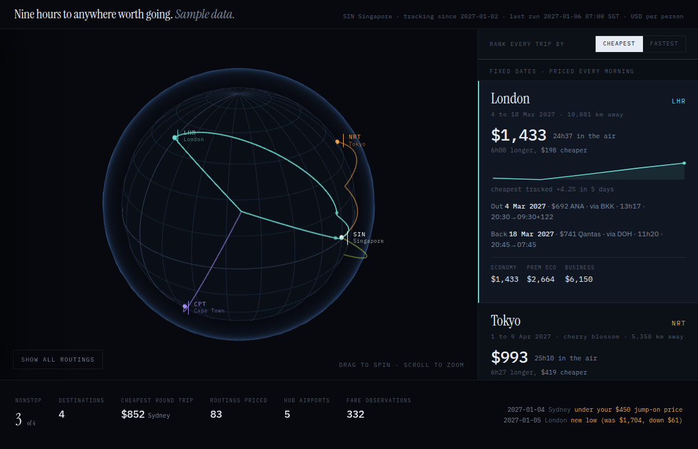

# Fare Atlas

A standing fare tracker that prices every way the world will route you somewhere,
every morning, and draws the answer on a globe.

It grew out of a specific problem. I live on an island with almost no long-haul
service, so every trip is a connection, and "is this a good price?" is not a
question one search answers. It needs a baseline, and a baseline needs history.



## What it does

**Prices trips you have dates for.** Each leg is priced as a one-way, every
morning, in every cabin you care about. One-ways rather than a round trip
because mixing carriers is usually cheaper and Google's round-trip endpoint
hides it. You get an alert when the cheapest combination moves more than a few
percent, and a digest on Sundays.

**Sweeps places you have no dates for.** A destination with a 270-day horizon
sampled two dates a day takes months to see. So each run one destination takes
its turn at a **sweep**, pricing dates spread across its whole horizon to find
the cheap month, while every other destination **refines** around its best known
departure to find the cheap week inside it. Set a price you would jump on and it
tells you when the fare goes under.

**Draws it.** The viewer is a globe with a great-circle arc per routing. Click a
destination for every itinerary priced today, ranked by cheapest, fastest, or a
balance of the two, with the stopovers marked on the map and the layover written
into the hub's label. Every row links straight out to that search on Google
Flights, so finding a fare and going to book it are the same gesture.

## Managing what it tracks

The quickest way is the browser. `serve.py` serves the viewer and a small API
behind it, and the viewer grows a **Manage destinations** panel when it finds
one: add, pause and remove without touching a file.

```bash
cd tracker && python3 serve.py        # http://127.0.0.1:8712
```

The form takes a **From** and a **To**, both with autocomplete over the
airports the tool knows, and naming an airport fills in its city. Most trips
leave from the same place, so From is prefilled with your configured origin;
override it and that destination is priced from somewhere else.

It binds to loopback, so nothing is reachable off the machine. Binding anywhere
else requires `--token` and refuses to start without one, because this API
writes to your config and starts pricing runs. Every field is validated and
bounded before it reaches the config, and nothing is ever passed to a shell.

Served as plain files instead, as a published copy would be, there is no API to
find and the panel simply does not appear.

The same operations are a CLI, which is what the server calls:

```bash
cd tracker

python3 destinations.py list

# a place you want to go, whenever it is cheap enough
python3 destinations.py watch SYD --city Sydney --why friends \
        --nights 10 --target 450

# ...or pinned to a month rather than a rolling horizon
python3 destinations.py watch CPT --city "Cape Town" \
        --window 2027-06-01 2027-06-30 --nights 14 --target 1100

# a trip you already have dates for, with three days either side
python3 destinations.py trip LHR --city London \
        --out 2027-03-04 --ret 2027-03-18 --flex 3 \
        --cabins economy,business

python3 destinations.py disable SYD     # keep the history, stop pricing it
python3 destinations.py remove  SYD
```

`config.yaml` is edited as text rather than parsed and rewritten. A YAML
round-trip would drop every comment in it, and the comments are where the
reasoning lives. Each write is validated by reparsing and rolled back if the
result would not load, because a tracker that cannot read its config does not
run at all.

Nothing else needs restarting. The next run picks up the change.

## Two readers, and why

Google Flights can be read two ways, and the difference is the design.

**SerpAPI** returns real round-trip pricing and, usefully, `price_insights`:
Google's own view of whether today's fare is low, typical or high against the
last sixty days. That context is worth paying for. It is also metered.

**A keyless read** of the same pages costs nothing. Round-trip queries come back
empty, but one-way queries work, which is fine here because one-ways are what we
want anyway.

So the money goes where it buys something. The core date of a fixed-date trip
uses SerpAPI, for the insights. The flexible dates either side of it, and the
entire watchlist, use the keyless reader. Concretely: three days of flexibility
on one trip across three cabins is 42 searches a day on a metered API, which is
1,260 a month and more quota than I have. On the free reader it is nothing, and
because it is nothing it runs *daily* rather than weekly. Flexibility you only
look at on Sundays is not flexibility.

That single decision is why the tracker can afford to check ±3 days on every
leg, every day, and why it found a business fare $924 cheaper by leaving three
days early.

## Running it

```bash
python3 -m venv .venv && .venv/bin/pip install pyyaml selectolax fast-flights
cp config.example.yaml config.yaml     # then edit it
cd tracker && ../.venv/bin/python tracker.py daily
```

`config.yaml` is gitignored. It holds your dates, your destinations and your
prices, and none of that belongs in a repository.

Alerts go to whatever `FARE_NOTIFY_CMD` points at: any executable taking
`--header` and reading the body on stdin. Leave it unset and everything prints
to the console instead.

For a daily run, `tracker/run.sh` is the cron entry point. It runs the
fixed-date trips, then the watchlist, then re-exports the viewer's data. The
watchlist runs with its exit code deliberately swallowed, so a reader failure
can never cost you a fixed-date alert; it reports its own failures instead of
going quiet with stale numbers.

## The viewer

```bash
cd tracker && python3 serve.py       # viewer plus the manage API
cd viewer  && python3 -m http.server # viewer alone, read only
```

It ships with a generated sample dataset so it runs straight from a checkout.
Point `DATA` at your own export to see your own trips.

The viewer knows nothing about any particular journey. Destinations, colours,
the origin airport and the headline all arrive in `fares.json`, which
`export_globe.py` writes from the database. Swapping in your own data is the
only step.

There are no coastlines on the globe. A graticule and the airports are honest;
hand-drawn continents would have been decoration pretending to be data.

## Layout

```
tracker/
  tracker.py       fixed-date trips: fetch, store, compare, alert, digest
  watchlist.py     no-date destinations: sweep, refine, alert on a price worth taking
  flights.py       keyless Google Flights one-way reader
  parse_gf_md.py   fallback parser for pages that only render client-side
  airports.py      the airports the tools can place and offer for autocomplete
  destinations.py  add, remove, enable and list what is tracked
  serve.py         the viewer plus a small API, so the browser can manage it
  export_globe.py  database -> the two JSON files the viewer reads
  make_sample.py   generates the sample dataset
  run.sh           cron entry point
viewer/
  index.html       the globe, three.js, no build step
  sample/          invented data so the page runs out of the box
```

Everything is stored in one SQLite file. Observations, the per-run best, the
alerts that fired and a receipt for every run, which matters more than it
sounds: when a fare tracker goes quiet you want to know whether the fares
stopped moving or the tracker stopped working.

## Notes worth knowing

Round-trip queries against the keyless reader return an empty block. Price each
direction one-way and add them; you were going to do that anyway to mix
carriers.

Some city pairs load entirely client-side and return nothing to any static read.
Those need a rendered scrape, which `parse_gf_md.py` parses. Google's markdown
uses narrow and non-breaking spaces around AM/PM, so normalise before matching.

Airports need coordinates to be drawn, and they live in one place,
`airports.py`, shared by the exporter and the picker. New hubs appear as fares
change, so the exporter drops any routing through an airport it cannot place
**and names it**, rather than letting one unknown code blank the page. Adding
the coordinate is then a one-line fix.

Prices are per person and in whatever currency you configure. They are what the
reader saw at that moment, not a quote.

## Licence

MIT.
